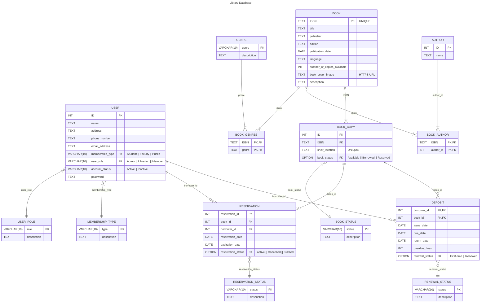

# Entity Relationship Diagrams

All entities might be appear:
1. Book
2. Author
3. Reader
4. Librarian

OPTIONS:
* Best Quality Image: [Open this file with Web Browser (Chrome, Edge, Safari) :star:](./mermaid-diagram-2024-08-13-221525.svg)

* PNG Image: [Click here to view the PNG file :framed_picture:](./mermaid-diagram-2024-08-13-221526.png) 