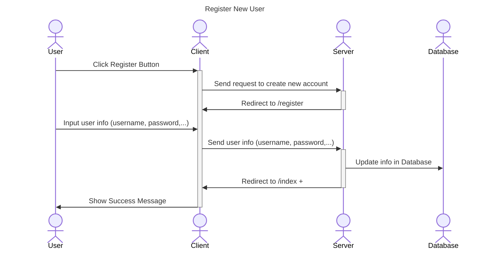
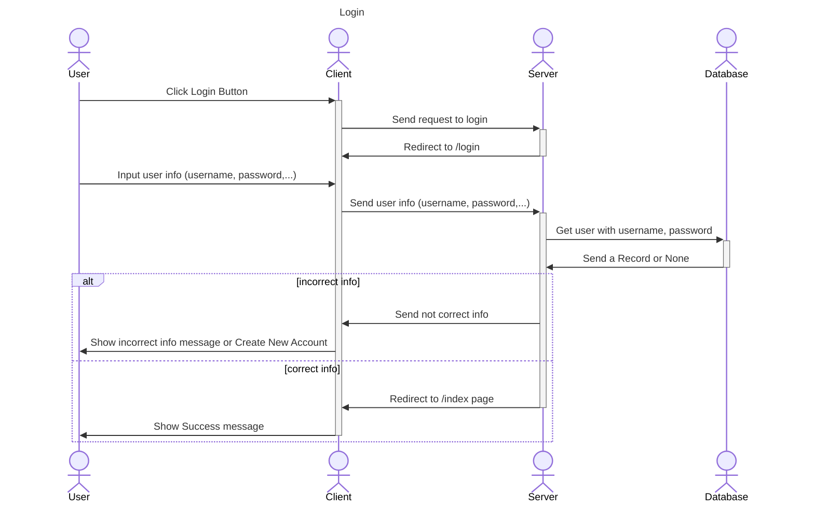
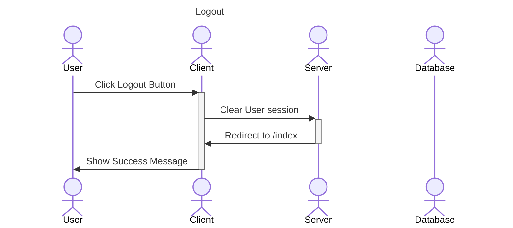
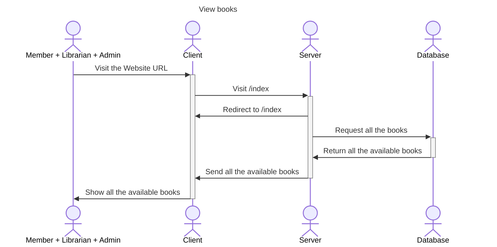
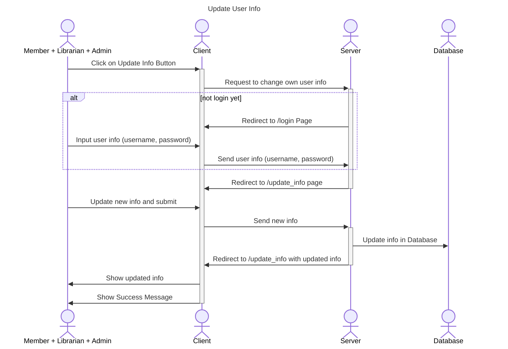

# Sequence Diagrams

Features:
1. <a href="#authentication">Authentication</a>
2. <a href="#common-features">Common Features</a>
3. <a href="#member-only">Member Only :student:</a> 
4. <a href="#librarian-only">Librarian Only :book:</a> 
5. <a href="#admin-only">Admin Only :desktop_computer:</a> 

Actors in **Library Systems Management**:
1. User
2. Client
3. Server
4. Database

## Authentication

Features:
1. <a href="#register">Register</a>
2. <a href="#login">Login</a>
3. <a href="#logout">Logout</a>

### Register

### Login 

### Logout 

-------------------------------------------------------------------------------

## Common Features
Features:
1. <a href="#view-all-books">View All Books</a>
2. <a href="#update-user-info">Update Personal Info</a>

### View All Books

### Update User Info

-------------------------------------------------------------------------------

## Member Only
TODO: Implement features that only member can do

## Librarian Only
TODO: Implement features that only librarian can do

## Admin Only
TODO: Implement features that only admin can do